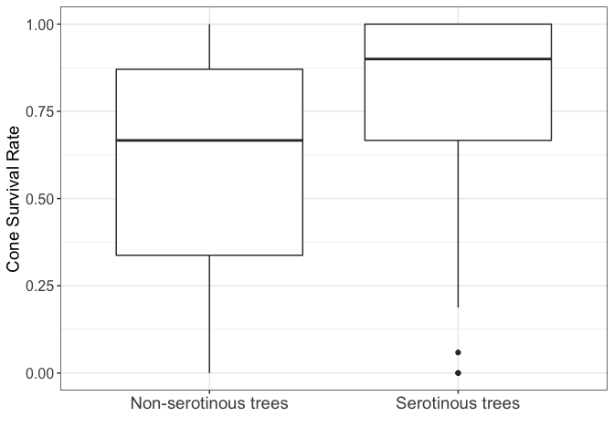
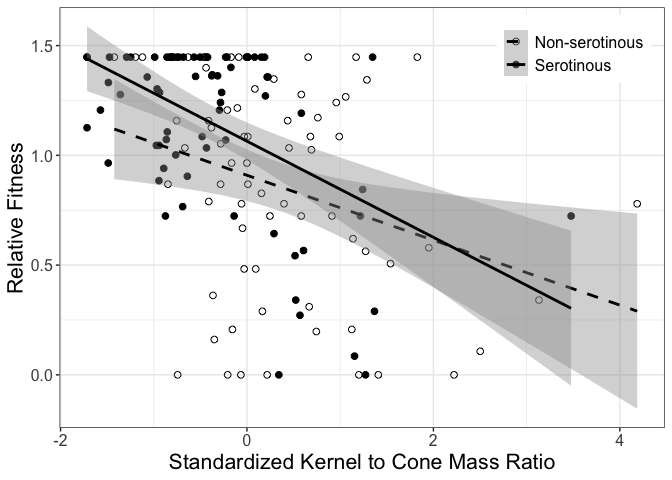
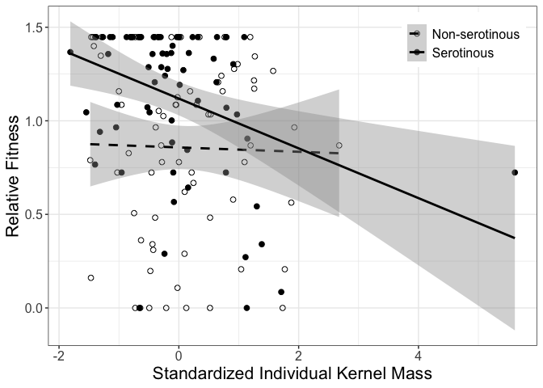
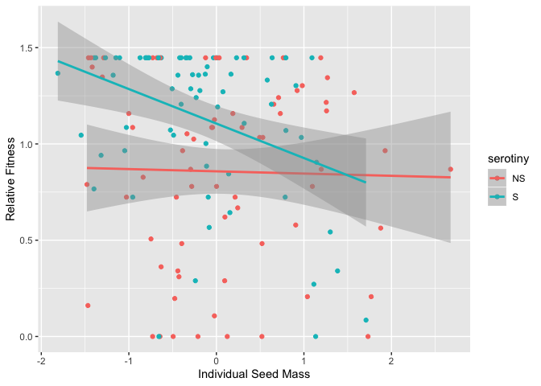
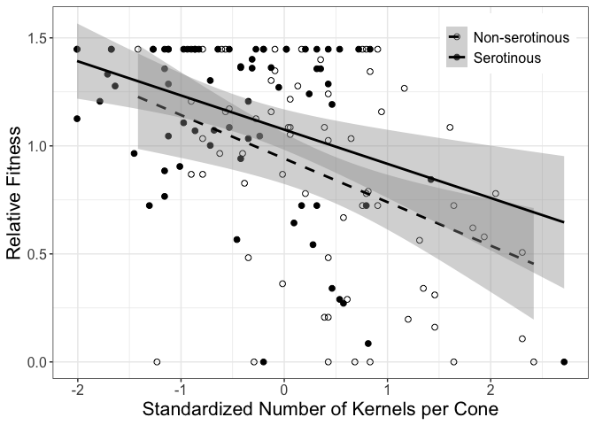

## Creating the Dataset: 


```r
library(ggplot2)
library(car)
```

```
## Loading required package: carData
```

```r
library(lme4)
```

```
## Loading required package: Matrix
```

```
## Registered S3 methods overwritten by 'lme4':
##   method                          from
##   cooks.distance.influence.merMod car 
##   influence.merMod                car 
##   dfbeta.influence.merMod         car 
##   dfbetas.influence.merMod        car
```

```r
library(lmerTest)
```

```
## 
## Attaching package: 'lmerTest'
```

```
## The following object is masked from 'package:lme4':
## 
##     lmer
```

```
## The following object is masked from 'package:stats':
## 
##     step
```

```r
library(plotrix)
library(Rmisc)
```

```
## Loading required package: lattice
```

```
## Loading required package: plyr
```

```r
library(dplyr)
```

```
## 
## Attaching package: 'dplyr'
```

```
## The following objects are masked from 'package:plyr':
## 
##     arrange, count, desc, failwith, id, mutate, rename, summarise,
##     summarize
```

```
## The following object is masked from 'package:car':
## 
##     recode
```

```
## The following objects are masked from 'package:stats':
## 
##     filter, lag
```

```
## The following objects are masked from 'package:base':
## 
##     intersect, setdiff, setequal, union
```

```r
library(MASS)
```

```
## 
## Attaching package: 'MASS'
```

```
## The following object is masked from 'package:dplyr':
## 
##     select
```

```r
library(MuMIn)
library(ggthemes)
```

### Calculations for additional metrics:


```r
thesis.data <- read.table("thesis_data_June10.csv", header = T, sep = ",")

thesis.data$survival <- (thesis.data$count.after / thesis.data$count.before)
thesis.data$midden <- as.factor(thesis.data$midden)
thesis.data$lw.ratio <- thesis.data$length / thesis.data$width 
thesis.data$relative.fitness <- thesis.data$survival / mean(thesis.data$survival) 
thesis.data$mass.indiv.seed <- thesis.data$mass.seed / thesis.data$count.seeds
thesis.data$mass.ratio <- thesis.data$mass.seed / thesis.data$mass.cone
thesis.data$wl.ratio <- thesis.data$width / thesis.data$length

thesis.data <- thesis.data[thesis.data$id != "2.12.15", ]

head(thesis.data)
```

```
##        id midden midden.S tree       lat       long serotiny  dbh distance
## 1 2.01.02      1     0.05    2 41.05.569 106.08.578       NS 22.3       27
## 2 2.01.05      1     0.05    5 41.05.561 106.08.575        S 23.2       19
## 3 2.01.07      1     0.05    7 41.05.549 106.08.571        S 22.9       29
## 4 2.01.08      1     0.05    8 41.05.547 106.08.575       NS 26.1       24
## 5 2.01.09      1     0.05    9 41.05.549 106.08.584       NS 19.1       16
## 6 2.01.11      1     0.05   11 41.05.540 106.08.598        S 17.2       31
##   direction cones.sampled   length    width width.scale count.seeds mass.cone
## 1        NE             3 37.38333 22.04000    5.292778    15.00000  4.068067
## 2        NE             3 35.24667 24.66667    5.753889    15.33333  5.273933
## 3        SE             3 36.84000 21.18333    4.838730    17.66667  4.062667
## 4        SE             2 35.93000 23.71500    4.150000    10.00000  4.586800
## 5         S             2 35.42000 23.46500    5.360000    33.00000  4.765750
## 6        SW             1 35.88000 24.15000    5.756667     9.00000  4.697400
##    mass.seed  mass.ratio count.before count.after  predation jdate.cone
## 1 0.04771667 0.011729569            3           1 0.66666667        259
## 2 0.03980667 0.007547814           33          31 0.06060606        259
## 3 0.05038667 0.012402363           41          36 0.12195122        259
## 4 0.02580000 0.005624836           10           6 0.40000000        259
## 5 0.08118000 0.017034045            8           4 0.50000000        259
## 6 0.03276000 0.006974071            8           5 0.37500000        259
##   ns.season  survival lw.ratio relative.fitness mass.indiv.seed  wl.ratio
## 1    spring 0.3333333 1.696158        0.4824721     0.003181111 0.5895675
## 2      <NA> 0.9393939 1.428919        1.3596942     0.002596087 0.6998298
## 3      <NA> 0.8780488 1.739103        1.2709022     0.002852075 0.5750090
## 4    spring 0.6000000 1.515075        0.8684498     0.002580000 0.6600334
## 5    spring 0.5000000 1.509482        0.7237082     0.002460000 0.6624788
## 6      <NA> 0.6250000 1.485714        0.9046352     0.003640000 0.6730769
```

### Standardizing the cone traits:


```r
z.thesis.data <- thesis.data

z.thesis.data$length <- scale(z.thesis.data$length, center = TRUE, scale = TRUE)
z.thesis.data$width <- scale(z.thesis.data$width, center = TRUE, scale = TRUE)
z.thesis.data$width.scale <- scale(z.thesis.data$width.scale, center = TRUE, scale = TRUE)
z.thesis.data$count.seeds <- scale(z.thesis.data$count.seeds, center = TRUE, scale = TRUE)
z.thesis.data$mass.ratio <- scale(z.thesis.data$mass.ratio, center = TRUE, scale = TRUE)
z.thesis.data$lw.ratio <- scale(z.thesis.data$lw.ratio, center = TRUE, scale = TRUE)
z.thesis.data$mass.indiv.seed <- scale(z.thesis.data$mass.indiv.seed, center = TRUE, scale = TRUE)
z.thesis.data$wl.ratio <- scale(z.thesis.data$wl.ratio, center = TRUE, scale = TRUE)

head(z.thesis.data)
```

```
##        id midden midden.S tree       lat       long serotiny  dbh distance
## 1 2.01.02      1     0.05    2 41.05.569 106.08.578       NS 22.3       27
## 2 2.01.05      1     0.05    5 41.05.561 106.08.575        S 23.2       19
## 3 2.01.07      1     0.05    7 41.05.549 106.08.571        S 22.9       29
## 4 2.01.08      1     0.05    8 41.05.547 106.08.575       NS 26.1       24
## 5 2.01.09      1     0.05    9 41.05.549 106.08.584       NS 19.1       16
## 6 2.01.11      1     0.05   11 41.05.540 106.08.598        S 17.2       31
##   direction cones.sampled     length      width width.scale count.seeds
## 1        NE             3 0.49102636 -0.2034728   0.6240675 -0.34803235
## 2        NE             3 0.02807849  0.6813902   1.0416187 -0.31116670
## 3        SE             3 0.37330327 -0.4920639   0.2129126 -0.05310716
## 4        SE             2 0.17613514  0.3607958  -0.4107550 -0.90101709
## 5         S             2 0.06563432  0.2765766   0.6849394  1.64271270
## 6        SW             1 0.16530173  0.5073372   1.0441341 -1.01161404
##   mass.cone  mass.seed  mass.ratio count.before count.after  predation
## 1  4.068067 0.04771667  0.09374939            3           1 0.66666667
## 2  5.273933 0.03980667 -0.55134902           33          31 0.06060606
## 3  4.062667 0.05038667  0.19753803           41          36 0.12195122
## 4  4.586800 0.02580000 -0.84799713           10           6 0.40000000
## 5  4.765750 0.08118000  0.91204446            8           4 0.50000000
## 6  4.697400 0.03276000 -0.63985750            8           5 0.37500000
##   jdate.cone ns.season  survival   lw.ratio relative.fitness mass.indiv.seed
## 1        259    spring 0.3333333  0.9312525        0.4824721      0.52164377
## 2        259      <NA> 0.9393939 -0.8685059        1.3596942     -0.27223033
## 3        259      <NA> 0.8780488  1.2204681        1.2709022      0.07514447
## 4        259    spring 0.6000000 -0.2882780        0.8684498     -0.29406026
## 5        259    spring 0.5000000 -0.3259423        0.7237082     -0.45689950
## 6        259      <NA> 0.6250000 -0.4860104        0.9046352      1.14435308
##     wl.ratio
## 1 -0.9457875
## 2  0.8494426
## 3 -1.1828211
## 4  0.2014996
## 5  0.2413147
## 6  0.4138672
```

### Splitting into NS and S Cohorts:


```r
z.thesis.data.NS <- z.thesis.data[z.thesis.data$serotiny == "NS",]
z.thesis.data.S <- z.thesis.data[z.thesis.data$serotiny == "S",]
```


## Table of values:
  - means of each trait (for serotinous and non-serotinous)
  - SEs
  - ranges

### Means:  

```r
thesis.subset <- subset(thesis.data, select = c(distance, serotiny, cones.sampled, length, width, width.scale, count.seeds, mass.cone, mass.seed, mass.ratio, count.before, count.after, survival, lw.ratio))

#Had to figure out a way to not get undefined for the ones with no seeds

thesis.subset$mass.indiv.seed <- thesis.subset$mass.seed / (thesis.subset$count.seeds + .000001)

#avg.mean <- aggregate(thesis.subset, list(serotiny = thesis.subset$serotiny), FUN = mean)
```

### Individual SE calculations per trait:  

```r
SE.distance <- summarySE(thesis.subset, measurevar = "distance", groupvars = "serotiny")
SE.cones.sampled <- summarySE(thesis.subset, measurevar = "cones.sampled", groupvars = "serotiny")
SE.length <- summarySE(thesis.subset, measurevar = "length", groupvars = "serotiny")
SE.width<- summarySE(thesis.subset, measurevar = "width", groupvars = "serotiny")
SE.width.scale <- summarySE(thesis.subset, measurevar = "width.scale", groupvars = "serotiny")
SE.count.seeds <- summarySE(thesis.subset, measurevar = "count.seeds", groupvars = "serotiny")
SE.mass.cone <- summarySE(thesis.subset, measurevar = "mass.cone", groupvars = "serotiny")
SE.mass.indiv.seed <- summarySE(thesis.subset, measurevar = "mass.indiv.seed", groupvars = "serotiny")
SE.mass.ratio <- summarySE(thesis.subset, measurevar = "mass.ratio", groupvars = "serotiny")
SE.count.before <- summarySE(thesis.subset, measurevar = "count.before", groupvars = "serotiny")
SE.count.after <- summarySE(thesis.subset, measurevar = "count.after", groupvars = "serotiny")
SE.survival <- summarySE(thesis.subset, measurevar = "survival", groupvars = "serotiny")
SE.lw.ratio <- summarySE(thesis.subset, measurevar = "lw.ratio", groupvars = "serotiny")
```

### T-tests for trait data:

```r
thesis.subset.NS <- thesis.subset[thesis.data$serotiny == "NS",]
thesis.subset.S <- thesis.subset[thesis.data$serotiny == "S",]
```


```r
t.test(thesis.subset.NS$distance, thesis.subset.S$distance)
```

```
## 
## 	Welch Two Sample t-test
## 
## data:  thesis.subset.NS$distance and thesis.subset.S$distance
## t = -0.36849, df = 140.6, p-value = 0.7131
## alternative hypothesis: true difference in means is not equal to 0
## 95 percent confidence interval:
##  -2.754064  1.888702
## sample estimates:
## mean of x mean of y 
##  29.47143  29.90411
```

```r
t.test(thesis.subset.NS$cones.sampled, thesis.subset.S$cones.sampled)
```

```
## 
## 	Welch Two Sample t-test
## 
## data:  thesis.subset.NS$cones.sampled and thesis.subset.S$cones.sampled
## t = -1.45, df = 134.79, p-value = 0.1494
## alternative hypothesis: true difference in means is not equal to 0
## 95 percent confidence interval:
##  -0.40062917  0.06168592
## sample estimates:
## mean of x mean of y 
##  2.542857  2.712329
```

```r
t.test(thesis.subset.NS$length, thesis.subset.S$length)
```

```
## 
## 	Welch Two Sample t-test
## 
## data:  thesis.subset.NS$length and thesis.subset.S$length
## t = 1.1309, df = 138.88, p-value = 0.2601
## alternative hypothesis: true difference in means is not equal to 0
## 95 percent confidence interval:
##  -0.6539011  2.4014177
## sample estimates:
## mean of x mean of y 
##  35.56312  34.68936
```

```r
t.test(thesis.subset.NS$width, thesis.subset.S$width)
```

```
## 
## 	Welch Two Sample t-test
## 
## data:  thesis.subset.NS$width and thesis.subset.S$width
## t = 0.66691, df = 140.6, p-value = 0.5059
## alternative hypothesis: true difference in means is not equal to 0
## 95 percent confidence interval:
##  -0.6519809  1.3157787
## sample estimates:
## mean of x mean of y 
##  22.81343  22.48153
```

```r
t.test(thesis.subset.NS$width.scale, thesis.subset.S$width.scale)
```

```
## 
## 	Welch Two Sample t-test
## 
## data:  thesis.subset.NS$width.scale and thesis.subset.S$width.scale
## t = -0.79175, df = 132.44, p-value = 0.4299
## alternative hypothesis: true difference in means is not equal to 0
## 95 percent confidence interval:
##  -0.5146571  0.2204242
## sample estimates:
## mean of x mean of y 
##  4.528505  4.675621
```

```r
t.test(thesis.subset.NS$count.seeds, thesis.subset.S$count.seeds)
```

```
## 
## 	Welch Two Sample t-test
## 
## data:  thesis.subset.NS$count.seeds and thesis.subset.S$count.seeds
## t = 5.3651, df = 140.69, p-value = 3.248e-07
## alternative hypothesis: true difference in means is not equal to 0
## 95 percent confidence interval:
##   4.687074 10.156957
## sample estimates:
## mean of x mean of y 
##  21.93571  14.51370
```

```r
t.test(thesis.subset.NS$mass.cone, thesis.subset.S$mass.cone)
```

```
## 
## 	Welch Two Sample t-test
## 
## data:  thesis.subset.NS$mass.cone and thesis.subset.S$mass.cone
## t = 1.538, df = 140.88, p-value = 0.1263
## alternative hypothesis: true difference in means is not equal to 0
## 95 percent confidence interval:
##  -0.09025868  0.72267145
## sample estimates:
## mean of x mean of y 
##  4.849505  4.533299
```

```r
t.test(thesis.subset.NS$mass.indiv.seed, thesis.subset.S$mass.indiv.seed)
```

```
## 
## 	Welch Two Sample t-test
## 
## data:  thesis.subset.NS$mass.indiv.seed and thesis.subset.S$mass.indiv.seed
## t = 1.7411, df = 132.65, p-value = 0.08399
## alternative hypothesis: true difference in means is not equal to 0
## 95 percent confidence interval:
##  -3.257362e-05  5.112932e-04
## sample estimates:
##   mean of x   mean of y 
## 0.002860218 0.002620858
```

```r
t.test(thesis.subset.NS$mass.ratio, thesis.subset.S$mass.ratio)
```

```
## 
## 	Welch Two Sample t-test
## 
## data:  thesis.subset.NS$mass.ratio and thesis.subset.S$mass.ratio
## t = 4.4042, df = 138.12, p-value = 2.112e-05
## alternative hypothesis: true difference in means is not equal to 0
## 95 percent confidence interval:
##  0.002480949 0.006523564
## sample estimates:
##  mean of x  mean of y 
## 0.01342021 0.00891795
```

```r
t.test(thesis.subset.NS$count.before, thesis.subset.S$count.before)
```

```
## 
## 	Welch Two Sample t-test
## 
## data:  thesis.subset.NS$count.before and thesis.subset.S$count.before
## t = -1.3994, df = 137.9, p-value = 0.1639
## alternative hypothesis: true difference in means is not equal to 0
## 95 percent confidence interval:
##  -5.2491131  0.8984282
## sample estimates:
## mean of x mean of y 
##  11.40000  13.57534
```

```r
t.test(thesis.subset.NS$count.after, thesis.subset.S$count.after)
```

```
## 
## 	Welch Two Sample t-test
## 
## data:  thesis.subset.NS$count.after and thesis.subset.S$count.after
## t = -2.6204, df = 137.58, p-value = 0.009769
## alternative hypothesis: true difference in means is not equal to 0
## 95 percent confidence interval:
##  -6.3391855 -0.8866462
## sample estimates:
## mean of x mean of y 
##  7.085714 10.698630
```

```r
t.test(thesis.subset.NS$lw.ratio, thesis.subset.S$lw.ratio)
```

```
## 
## 	Welch Two Sample t-test
## 
## data:  thesis.subset.NS$lw.ratio and thesis.subset.S$lw.ratio
## t = 0.53077, df = 139.61, p-value = 0.5964
## alternative hypothesis: true difference in means is not equal to 0
## 95 percent confidence interval:
##  -0.03591005  0.06226669
## sample estimates:
## mean of x mean of y 
##  1.564608  1.551429
```


### T-test for survival

```r
t.test(z.thesis.data.NS$survival, z.thesis.data.S$survival)
```

```
## 
## 	Welch Two Sample t-test
## 
## data:  z.thesis.data.NS$survival and z.thesis.data.S$survival
## t = -3.8293, df = 132.98, p-value = 0.0001971
## alternative hypothesis: true difference in means is not equal to 0
## 95 percent confidence interval:
##  -0.29549228 -0.09420125
## sample estimates:
## mean of x mean of y 
## 0.5919099 0.7867566
```

## Selection Gradients: 

### 3 cone traits of interest

```r
additive <- glm(relative.fitness ~ lw.ratio + mass.ratio + serotiny + width.scale, data = z.thesis.data)

summary(additive)
```

```
## 
## Call:
## glm(formula = relative.fitness ~ lw.ratio + mass.ratio + serotiny + 
##     width.scale, data = z.thesis.data)
## 
## Deviance Residuals: 
##      Min        1Q    Median        3Q       Max  
## -1.06743  -0.22411   0.08472   0.29103   0.86178  
## 
## Coefficients:
##              Estimate Std. Error t value Pr(>|t|)    
## (Intercept)  0.919220   0.050694  18.133  < 2e-16 ***
## lw.ratio    -0.004914   0.035115  -0.140   0.8889    
## mass.ratio  -0.177800   0.037653  -4.722 5.67e-06 ***
## serotinyS    0.159633   0.073396   2.175   0.0313 *  
## width.scale -0.011511   0.034985  -0.329   0.7426    
## ---
## Signif. codes:  0 '***' 0.001 '**' 0.01 '*' 0.05 '.' 0.1 ' ' 1
## 
## (Dispersion parameter for gaussian family taken to be 0.1667452)
## 
##     Null deviance: 29.938  on 142  degrees of freedom
## Residual deviance: 23.011  on 138  degrees of freedom
## AIC: 156.57
## 
## Number of Fisher Scoring iterations: 2
```

### Cone traits of interest and potential confounding variables

**Utilized gradient analysis** 

```r
alltraits <- glm(relative.fitness ~ lw.ratio + mass.ratio + serotiny + width.scale + jdate.cone + dbh + distance + direction + midden.S, data = z.thesis.data)

summary(alltraits)
```

```
## 
## Call:
## glm(formula = relative.fitness ~ lw.ratio + mass.ratio + serotiny + 
##     width.scale + jdate.cone + dbh + distance + direction + midden.S, 
##     data = z.thesis.data)
## 
## Deviance Residuals: 
##      Min        1Q    Median        3Q       Max  
## -1.11112  -0.24935   0.04914   0.26916   0.86004  
## 
## Coefficients:
##               Estimate Std. Error t value Pr(>|t|)    
## (Intercept)  3.1810355  2.3327436   1.364   0.1751    
## lw.ratio    -0.0208054  0.0370257  -0.562   0.5752    
## mass.ratio  -0.1699189  0.0403264  -4.214 4.75e-05 ***
## serotinyS    0.1475675  0.0777781   1.897   0.0601 .  
## width.scale -0.0002579  0.0378629  -0.007   0.9946    
## jdate.cone  -0.0096672  0.0091268  -1.059   0.2915    
## dbh          0.0114539  0.0093064   1.231   0.2207    
## distance     0.0010317  0.0054130   0.191   0.8491    
## directionN  -0.2041632  0.1624294  -1.257   0.2111    
## directionNE -0.1120197  0.1566411  -0.715   0.4758    
## directionNW -0.1565889  0.1662367  -0.942   0.3480    
## directionS  -0.1591698  0.1566106  -1.016   0.3114    
## directionSE -0.0844354  0.1649720  -0.512   0.6097    
## directionSW -0.1886082  0.1680318  -1.122   0.2638    
## directionW  -0.1700266  0.1472841  -1.154   0.2505    
## midden.S     0.3001603  0.2318474   1.295   0.1978    
## ---
## Signif. codes:  0 '***' 0.001 '**' 0.01 '*' 0.05 '.' 0.1 ' ' 1
## 
## (Dispersion parameter for gaussian family taken to be 0.1729165)
## 
##     Null deviance: 29.806  on 141  degrees of freedom
## Residual deviance: 21.787  on 126  degrees of freedom
##   (1 observation deleted due to missingness)
## AIC: 170.8
## 
## Number of Fisher Scoring iterations: 2
```

### Double-checking Midden Serotiny level 


```r
checkingmiddenS <- glm(relative.fitness ~ lw.ratio + mass.ratio + width.scale + serotiny + midden.S, data = z.thesis.data)

summary(checkingmiddenS)
```

```
## 
## Call:
## glm(formula = relative.fitness ~ lw.ratio + mass.ratio + width.scale + 
##     serotiny + midden.S, data = z.thesis.data)
## 
## Deviance Residuals: 
##      Min        1Q    Median        3Q       Max  
## -1.06155  -0.22768   0.09449   0.30517   0.86385  
## 
## Coefficients:
##              Estimate Std. Error t value Pr(>|t|)    
## (Intercept)  0.844988   0.078801  10.723  < 2e-16 ***
## lw.ratio    -0.007484   0.035113  -0.213   0.8315    
## mass.ratio  -0.175384   0.037635  -4.660  7.4e-06 ***
## width.scale -0.010009   0.034942  -0.286   0.7750    
## serotinyS    0.143744   0.074393   1.932   0.0554 .  
## midden.S     0.267613   0.217776   1.229   0.2212    
## ---
## Signif. codes:  0 '***' 0.001 '**' 0.01 '*' 0.05 '.' 0.1 ' ' 1
## 
## (Dispersion parameter for gaussian family taken to be 0.1661311)
## 
##     Null deviance: 29.938  on 142  degrees of freedom
## Residual deviance: 22.760  on 137  degrees of freedom
## AIC: 157.01
## 
## Number of Fisher Scoring iterations: 2
```

Nope, not significant!! 

### Checking for interactions: 


```r
checkingmiddenSint <- glm(relative.fitness ~ mass.ratio*serotiny*midden.S, data = z.thesis.data)

summary(checkingmiddenSint)
```

```
## 
## Call:
## glm(formula = relative.fitness ~ mass.ratio * serotiny * midden.S, 
##     data = z.thesis.data)
## 
## Deviance Residuals: 
##      Min        1Q    Median        3Q       Max  
## -1.00869  -0.25622   0.07782   0.29592   0.82881  
## 
## Coefficients:
##                               Estimate Std. Error t value Pr(>|t|)    
## (Intercept)                     0.7635     0.1073   7.114 5.97e-11 ***
## mass.ratio                     -0.1927     0.1302  -1.480   0.1411    
## serotinyS                       0.4105     0.1603   2.561   0.0115 *  
## midden.S                        0.5293     0.3442   1.538   0.1264    
## mass.ratio:serotinyS            0.2389     0.1853   1.289   0.1995    
## mass.ratio:midden.S             0.1641     0.4422   0.371   0.7111    
## serotinyS:midden.S             -0.8992     0.4793  -1.876   0.0628 .  
## mass.ratio:serotinyS:midden.S  -0.9836     0.5790  -1.699   0.0917 .  
## ---
## Signif. codes:  0 '***' 0.001 '**' 0.01 '*' 0.05 '.' 0.1 ' ' 1
## 
## (Dispersion parameter for gaussian family taken to be 0.1598974)
## 
##     Null deviance: 29.938  on 142  degrees of freedom
## Residual deviance: 21.586  on 135  degrees of freedom
## AIC: 153.43
## 
## Number of Fisher Scoring iterations: 2
```

### Interactions with traits of interest:

```r
allinteractions <- glm(relative.fitness ~ mass.ratio*serotiny*lw.ratio*width.scale, data = z.thesis.data)
summary(allinteractions)
```

```
## 
## Call:
## glm(formula = relative.fitness ~ mass.ratio * serotiny * lw.ratio * 
##     width.scale, data = z.thesis.data)
## 
## Deviance Residuals: 
##      Min        1Q    Median        3Q       Max  
## -1.01062  -0.20392   0.04225   0.28582   0.75025  
## 
## Coefficients:
##                                            Estimate Std. Error t value Pr(>|t|)
## (Intercept)                                0.881288   0.054603  16.140   <2e-16
## mass.ratio                                -0.122234   0.060539  -2.019   0.0456
## serotinyS                                  0.162720   0.076923   2.115   0.0364
## lw.ratio                                   0.008174   0.058346   0.140   0.8888
## width.scale                               -0.021265   0.047194  -0.451   0.6531
## mass.ratio:serotinyS                      -0.140747   0.084964  -1.657   0.1001
## mass.ratio:lw.ratio                       -0.002716   0.048543  -0.056   0.9555
## serotinyS:lw.ratio                        -0.106308   0.079618  -1.335   0.1842
## mass.ratio:width.scale                     0.116425   0.075357   1.545   0.1248
## serotinyS:width.scale                      0.034481   0.085170   0.405   0.6863
## lw.ratio:width.scale                       0.013466   0.059766   0.225   0.8221
## mass.ratio:serotinyS:lw.ratio             -0.160834   0.086703  -1.855   0.0659
## mass.ratio:serotinyS:width.scale          -0.171002   0.101893  -1.678   0.0958
## mass.ratio:lw.ratio:width.scale            0.039294   0.092562   0.425   0.6719
## serotinyS:lw.ratio:width.scale            -0.083828   0.080946  -1.036   0.3024
## mass.ratio:serotinyS:lw.ratio:width.scale -0.039913   0.124531  -0.321   0.7491
##                                              
## (Intercept)                               ***
## mass.ratio                                *  
## serotinyS                                 *  
## lw.ratio                                     
## width.scale                                  
## mass.ratio:serotinyS                         
## mass.ratio:lw.ratio                          
## serotinyS:lw.ratio                           
## mass.ratio:width.scale                       
## serotinyS:width.scale                        
## lw.ratio:width.scale                         
## mass.ratio:serotinyS:lw.ratio             .  
## mass.ratio:serotinyS:width.scale          .  
## mass.ratio:lw.ratio:width.scale              
## serotinyS:lw.ratio:width.scale               
## mass.ratio:serotinyS:lw.ratio:width.scale    
## ---
## Signif. codes:  0 '***' 0.001 '**' 0.01 '*' 0.05 '.' 0.1 ' ' 1
## 
## (Dispersion parameter for gaussian family taken to be 0.1626352)
## 
##     Null deviance: 29.938  on 142  degrees of freedom
## Residual deviance: 20.655  on 127  degrees of freedom
## AIC: 163.13
## 
## Number of Fisher Scoring iterations: 2
```

### Significant terms from that model:

```r
sigfromall <- glm(relative.fitness ~ mass.ratio + serotiny + mass.ratio:serotiny:lw.ratio, data = z.thesis.data)

summary(sigfromall)
```

```
## 
## Call:
## glm(formula = relative.fitness ~ mass.ratio + serotiny + mass.ratio:serotiny:lw.ratio, 
##     data = z.thesis.data)
## 
## Deviance Residuals: 
##      Min        1Q    Median        3Q       Max  
## -1.08548  -0.20722   0.06971   0.29436   0.88267  
## 
## Coefficients:
##                                Estimate Std. Error t value Pr(>|t|)    
## (Intercept)                     0.92217    0.05094  18.102  < 2e-16 ***
## mass.ratio                     -0.19685    0.03952  -4.981 1.86e-06 ***
## serotinyS                       0.15396    0.07238   2.127   0.0352 *  
## mass.ratio:serotinyNS:lw.ratio  0.01367    0.04480   0.305   0.7606    
## mass.ratio:serotinyS:lw.ratio  -0.09912    0.05946  -1.667   0.0978 .  
## ---
## Signif. codes:  0 '***' 0.001 '**' 0.01 '*' 0.05 '.' 0.1 ' ' 1
## 
## (Dispersion parameter for gaussian family taken to be 0.1635561)
## 
##     Null deviance: 29.938  on 142  degrees of freedom
## Residual deviance: 22.571  on 138  degrees of freedom
## AIC: 153.81
## 
## Number of Fisher Scoring iterations: 2
```

### Simple interactive:

```r
simpleinteractive <- glm(relative.fitness ~ mass.ratio*serotiny, data = z.thesis.data)

summary(simpleinteractive)
```

```
## 
## Call:
## glm(formula = relative.fitness ~ mass.ratio * serotiny, data = z.thesis.data)
## 
## Deviance Residuals: 
##      Min        1Q    Median        3Q       Max  
## -1.01919  -0.23072   0.06026   0.29502   0.80848  
## 
## Coefficients:
##                      Estimate Std. Error t value Pr(>|t|)    
## (Intercept)           0.90918    0.05155  17.636  < 2e-16 ***
## mass.ratio           -0.14789    0.04939  -2.994  0.00326 ** 
## serotinyS             0.15517    0.07241   2.143  0.03387 *  
## mass.ratio:serotinyS -0.07099    0.07288  -0.974  0.33170    
## ---
## Signif. codes:  0 '***' 0.001 '**' 0.01 '*' 0.05 '.' 0.1 ' ' 1
## 
## (Dispersion parameter for gaussian family taken to be 0.164564)
## 
##     Null deviance: 29.938  on 142  degrees of freedom
## Residual deviance: 22.874  on 139  degrees of freedom
## AIC: 153.72
## 
## Number of Fisher Scoring iterations: 2
```

### Simple additive:

```r
simpleadditive <- glm(relative.fitness ~ mass.ratio + serotiny, data = z.thesis.data)

summary(simpleadditive)
```

```
## 
## Call:
## glm(formula = relative.fitness ~ mass.ratio + serotiny, data = z.thesis.data)
## 
## Deviance Residuals: 
##     Min       1Q   Median       3Q      Max  
## -1.0550  -0.2104   0.0812   0.2835   0.8565  
## 
## Coefficients:
##             Estimate Std. Error t value Pr(>|t|)    
## (Intercept)  0.92074    0.05016  18.357  < 2e-16 ***
## mass.ratio  -0.18050    0.03631  -4.971 1.92e-06 ***
## serotinyS    0.15666    0.07238   2.164   0.0321 *  
## ---
## Signif. codes:  0 '***' 0.001 '**' 0.01 '*' 0.05 '.' 0.1 ' ' 1
## 
## (Dispersion parameter for gaussian family taken to be 0.1645039)
## 
##     Null deviance: 29.938  on 142  degrees of freedom
## Residual deviance: 23.031  on 140  degrees of freedom
## AIC: 152.7
## 
## Number of Fisher Scoring iterations: 2
```


### AICc Calculations

```r
AICvals <- AIC(additive, alltraits, checkingmiddenS, checkingmiddenSint, allinteractions, sigfromall, simpleinteractive, simpleadditive)
```

```
## Warning in AIC.default(additive, alltraits, checkingmiddenS,
## checkingmiddenSint, : models are not all fitted to the same number of
## observations
```

```r
AICvals$corrected <- c(AICc(additive), AICc(alltraits), AICc(checkingmiddenS), AICc(checkingmiddenSint), AICc(allinteractions), AICc(sigfromall), AICc(simpleinteractive), AICc(simpleadditive))
AICvals$deltacorr <- AICvals$corrected - min(AICvals$corrected)

AICvals
```

```
##                    df      AIC corrected deltacorr
## additive            6 156.5727  157.1903  4.205348
## alltraits          17 170.8007  175.7362 22.751260
## checkingmiddenS     7 157.0051  157.8347  4.849763
## checkingmiddenSint  9 153.4331  154.7865  1.801510
## allinteractions    17 163.1253  168.0213 15.036341
## sigfromall          6 153.8112  154.4288  1.443887
## simpleinteractive   5 153.7222  154.1602  1.175246
## simpleadditive      4 152.6951  152.9850  0.000000
```

## VIF Calculations:

```r
#In Table Order:
vif(alltraits) #NO
```

```
##                 GVIF Df GVIF^(1/(2*Df))
## lw.ratio    1.122294  1        1.059384
## mass.ratio  1.334106  1        1.155035
## serotiny    1.241711  1        1.114321
## width.scale 1.170185  1        1.081751
## jdate.cone  1.067954  1        1.033419
## dbh         1.151400  1        1.073033
## distance    1.175403  1        1.084160
## direction   1.544433  7        1.031534
## midden.S    1.122109  1        1.059296
```

```r
vif(allinteractions) #YES - interactions, duh 
```

```
##                               mass.ratio 
##                                 3.199976 
##                                 serotiny 
##                                 1.300104 
##                                 lw.ratio 
##                                 2.972284 
##                              width.scale 
##                                 1.944688 
##                      mass.ratio:serotiny 
##                                 2.726978 
##                      mass.ratio:lw.ratio 
##                                 2.092463 
##                        serotiny:lw.ratio 
##                                 3.212665 
##                   mass.ratio:width.scale 
##                                 3.257416 
##                     serotiny:width.scale 
##                                 2.552189 
##                     lw.ratio:width.scale 
##                                 3.150084 
##             mass.ratio:serotiny:lw.ratio 
##                                 2.241209 
##          mass.ratio:serotiny:width.scale 
##                                 3.829574 
##          mass.ratio:lw.ratio:width.scale 
##                                 3.171988 
##            serotiny:lw.ratio:width.scale 
##                                 3.558978 
## mass.ratio:serotiny:lw.ratio:width.scale 
##                                 3.408167
```

```r
vif(additive) #NO
```

```
##    lw.ratio  mass.ratio    serotiny width.scale 
##    1.050077    1.207333    1.154451    1.042332
```

```r
vif(simpleinteractive) #YES - interaction again
```

```
##          mass.ratio            serotiny mass.ratio:serotiny 
##            2.105063            1.138672            1.982835
```

```r
vif(simpleadditive) #NO
```

```
## mass.ratio   serotiny 
##   1.138165   1.138165
```

```r
vif(glm(relative.fitness ~ length + width + mass.cone + mass.seed + serotiny + width.scale + jdate.cone + dbh + distance + direction + midden.S, data = z.thesis.data)) #YES
```

```
##                 GVIF Df GVIF^(1/(2*Df))
## length      3.850938  1        1.962381
## width       6.371144  1        2.524112
## mass.cone   4.662471  1        2.159276
## mass.seed   1.573776  1        1.254502
## serotiny    1.285467  1        1.133784
## width.scale 4.594929  1        2.143579
## jdate.cone  1.144195  1        1.069670
## dbh         1.170754  1        1.082014
## distance    1.207146  1        1.098702
## direction   1.764869  7        1.041411
## midden.S    1.137686  1        1.066624
```

```r
vif(glm(relative.fitness ~ length + width + mass.cone + width.scale, data = z.thesis.data)) #YES
```

```
##      length       width   mass.cone width.scale 
##    3.160482    5.388183    3.904368    3.413231
```

```r
vif(glm(relative.fitness ~ length + width, data = z.thesis.data)) #YES
```

```
##   length    width 
## 2.205839 2.205839
```

```r
vif(glm(relative.fitness ~ length + mass.cone, data = z.thesis.data)) #NO
```

```
##    length mass.cone 
##  1.887964  1.887964
```

```r
vif(glm(relative.fitness ~ length + width.scale, data = z.thesis.data)) #NO
```

```
##      length width.scale 
##    1.760966    1.760966
```

```r
vif(glm(relative.fitness ~ width + mass.cone, data = z.thesis.data)) #YES
```

```
##     width mass.cone 
##  2.305374  2.305374
```

```r
vif(glm(relative.fitness ~ width + width.scale, data = z.thesis.data)) #YES (barely)
```

```
##       width width.scale 
##     2.03601     2.03601
```

```r
vif(glm(relative.fitness ~ mass.cone + width.scale, data = z.thesis.data)) #NO
```

```
##   mass.cone width.scale 
##    1.115021    1.115021
```

```r
vif(glm(relative.fitness ~ lw.ratio + width.scale, data = z.thesis.data)) #NO
```

```
##    lw.ratio width.scale 
##      1.0098      1.0098
```

```r
vif(glm(relative.fitness ~ lw.ratio + mass.cone, data = z.thesis.data)) #NO
```

```
##  lw.ratio mass.cone 
##  1.008427  1.008427
```

## Selection Differentials:

### Length to Width Ratio

```r
lwmodNS <- glm(relative.fitness ~ lw.ratio, data = z.thesis.data.NS)

summary(lwmodNS)
```

```
## 
## Call:
## glm(formula = relative.fitness ~ lw.ratio, data = z.thesis.data.NS)
## 
## Deviance Residuals: 
##     Min       1Q   Median       3Q      Max  
## -0.9120  -0.3515   0.1116   0.3993   0.6299  
## 
## Coefficients:
##             Estimate Std. Error t value Pr(>|t|)    
## (Intercept)  0.85821    0.05800  14.796   <2e-16 ***
## lw.ratio    -0.03243    0.06291  -0.515    0.608    
## ---
## Signif. codes:  0 '***' 0.001 '**' 0.01 '*' 0.05 '.' 0.1 ' ' 1
## 
## (Dispersion parameter for gaussian family taken to be 0.2349311)
## 
##     Null deviance: 16.038  on 69  degrees of freedom
## Residual deviance: 15.975  on 68  degrees of freedom
## AIC: 101.23
## 
## Number of Fisher Scoring iterations: 2
```


```r
lwmodS <- glm(relative.fitness ~ lw.ratio, data = z.thesis.data.S)

summary(lwmodS)
```

```
## 
## Call:
## glm(formula = relative.fitness ~ lw.ratio, data = z.thesis.data.S)
## 
## Deviance Residuals: 
##     Min       1Q   Median       3Q      Max  
## -1.1364  -0.2169   0.1721   0.3086   0.4232  
## 
## Coefficients:
##             Estimate Std. Error t value Pr(>|t|)    
## (Intercept)  1.13731    0.04603  24.706   <2e-16 ***
## lw.ratio    -0.03353    0.04330  -0.774    0.441    
## ---
## Signif. codes:  0 '***' 0.001 '**' 0.01 '*' 0.05 '.' 0.1 ' ' 1
## 
## (Dispersion parameter for gaussian family taken to be 0.1544359)
## 
##     Null deviance: 11.058  on 72  degrees of freedom
## Residual deviance: 10.965  on 71  degrees of freedom
## AIC: 74.775
## 
## Number of Fisher Scoring iterations: 2
```

### Cone to Seed Mass Ratio

```r
massmodNS <- glm(relative.fitness ~ mass.ratio, data = z.thesis.data.NS)

summary(massmodNS)
```

```
## 
## Call:
## glm(formula = relative.fitness ~ mass.ratio, data = z.thesis.data.NS)
## 
## Deviance Residuals: 
##      Min        1Q    Median        3Q       Max  
## -1.01919  -0.23118   0.04354   0.37434   0.80848  
## 
## Coefficients:
##             Estimate Std. Error t value Pr(>|t|)    
## (Intercept)  0.90918    0.05881  15.460   <2e-16 ***
## mass.ratio  -0.14789    0.05634  -2.625   0.0107 *  
## ---
## Signif. codes:  0 '***' 0.001 '**' 0.01 '*' 0.05 '.' 0.1 ' ' 1
## 
## (Dispersion parameter for gaussian family taken to be 0.2141518)
## 
##     Null deviance: 16.038  on 69  degrees of freedom
## Residual deviance: 14.562  on 68  degrees of freedom
## AIC: 94.747
## 
## Number of Fisher Scoring iterations: 2
```


```r
massmodS <- glm(relative.fitness ~ mass.ratio, data = z.thesis.data.S)

summary(massmodS)
```

```
## 
## Call:
## glm(formula = relative.fitness ~ mass.ratio, data = z.thesis.data.S)
## 
## Deviance Residuals: 
##      Min        1Q    Median        3Q       Max  
## -0.98952  -0.22959   0.07724   0.23347   0.67807  
## 
## Coefficients:
##             Estimate Std. Error t value Pr(>|t|)    
## (Intercept)  1.06435    0.04289  24.814  < 2e-16 ***
## mass.ratio  -0.21888    0.04520  -4.843 7.25e-06 ***
## ---
## Signif. codes:  0 '***' 0.001 '**' 0.01 '*' 0.05 '.' 0.1 ' ' 1
## 
## (Dispersion parameter for gaussian family taken to be 0.1170715)
## 
##     Null deviance: 11.0576  on 72  degrees of freedom
## Residual deviance:  8.3121  on 71  degrees of freedom
## AIC: 54.554
## 
## Number of Fisher Scoring iterations: 2
```

### Scale Width

```r
widthmodNS <- glm(relative.fitness ~ width.scale, data = z.thesis.data.NS)

summary(widthmodNS)
```

```
## 
## Call:
## glm(formula = relative.fitness ~ width.scale, data = z.thesis.data.NS)
## 
## Deviance Residuals: 
##     Min       1Q   Median       3Q      Max  
## -0.8866  -0.3561   0.1071   0.4339   0.7558  
## 
## Coefficients:
##             Estimate Std. Error t value Pr(>|t|)    
## (Intercept)  0.85341    0.05779  14.768   <2e-16 ***
## width.scale -0.04902    0.05256  -0.933    0.354    
## ---
## Signif. codes:  0 '***' 0.001 '**' 0.01 '*' 0.05 '.' 0.1 ' ' 1
## 
## (Dispersion parameter for gaussian family taken to be 0.2328706)
## 
##     Null deviance: 16.038  on 69  degrees of freedom
## Residual deviance: 15.835  on 68  degrees of freedom
## AIC: 100.61
## 
## Number of Fisher Scoring iterations: 2
```


```r
widthmodS <- glm(relative.fitness ~ width.scale, data = z.thesis.data.S)

summary(widthmodS)
```

```
## 
## Call:
## glm(formula = relative.fitness ~ width.scale, data = z.thesis.data.S)
## 
## Deviance Residuals: 
##     Min       1Q   Median       3Q      Max  
## -1.1383  -0.1768   0.1804   0.3047   0.3257  
## 
## Coefficients:
##             Estimate Std. Error t value Pr(>|t|)    
## (Intercept)  1.13975    0.04629  24.623   <2e-16 ***
## width.scale -0.01508    0.05221  -0.289    0.774    
## ---
## Signif. codes:  0 '***' 0.001 '**' 0.01 '*' 0.05 '.' 0.1 ' ' 1
## 
## (Dispersion parameter for gaussian family taken to be 0.1555577)
## 
##     Null deviance: 11.058  on 72  degrees of freedom
## Residual deviance: 11.045  on 71  degrees of freedom
## AIC: 75.303
## 
## Number of Fisher Scoring iterations: 2
```

### Number of Full Seeds


```r
numseedNS <- glm(relative.fitness ~ count.seeds, data = z.thesis.data.NS)

summary(numseedNS)
```

```
## 
## Call:
## glm(formula = relative.fitness ~ count.seeds, data = z.thesis.data.NS)
## 
## Deviance Residuals: 
##      Min        1Q    Median        3Q       Max  
## -1.18960  -0.31034   0.06537   0.34420   0.87440  
## 
## Coefficients:
##             Estimate Std. Error t value Pr(>|t|)    
## (Intercept)  0.94118    0.05902  15.946  < 2e-16 ***
## count.seeds -0.20151    0.05890  -3.421  0.00106 ** 
## ---
## Signif. codes:  0 '***' 0.001 '**' 0.01 '*' 0.05 '.' 0.1 ' ' 1
## 
## (Dispersion parameter for gaussian family taken to be 0.2012159)
## 
##     Null deviance: 16.038  on 69  degrees of freedom
## Residual deviance: 13.683  on 68  degrees of freedom
## AIC: 90.386
## 
## Number of Fisher Scoring iterations: 2
```


```r
numseedS <- glm(relative.fitness ~ count.seeds, data = z.thesis.data.S)

summary(numseedS)
```

```
## 
## Call:
## glm(formula = relative.fitness ~ count.seeds, data = z.thesis.data.S)
## 
## Deviance Residuals: 
##     Min       1Q   Median       3Q      Max  
## -1.1069  -0.2074   0.1071   0.2413   0.6613  
## 
## Coefficients:
##             Estimate Std. Error t value Pr(>|t|)    
## (Intercept)  1.07518    0.04697  22.889  < 2e-16 ***
## count.seeds -0.15824    0.04739  -3.339  0.00134 ** 
## ---
## Signif. codes:  0 '***' 0.001 '**' 0.01 '*' 0.05 '.' 0.1 ' ' 1
## 
## (Dispersion parameter for gaussian family taken to be 0.1346066)
## 
##     Null deviance: 11.0576  on 72  degrees of freedom
## Residual deviance:  9.5571  on 71  degrees of freedom
## AIC: 64.743
## 
## Number of Fisher Scoring iterations: 2
```

### Individual Seed Mass:


```r
seedmassNS <- glm(relative.fitness ~ mass.indiv.seed, data = z.thesis.data.NS)

summary(seedmassNS)
```

```
## 
## Call:
## glm(formula = relative.fitness ~ mass.indiv.seed, data = z.thesis.data.NS)
## 
## Deviance Residuals: 
##     Min       1Q   Median       3Q      Max  
## -0.8662  -0.3669   0.1162   0.4181   0.6036  
## 
## Coefficients:
##                 Estimate Std. Error t value Pr(>|t|)    
## (Intercept)      0.85774    0.05828  14.719   <2e-16 ***
## mass.indiv.seed -0.01165    0.06207  -0.188    0.852    
## ---
## Signif. codes:  0 '***' 0.001 '**' 0.01 '*' 0.05 '.' 0.1 ' ' 1
## 
## (Dispersion parameter for gaussian family taken to be 0.2357269)
## 
##     Null deviance: 16.038  on 69  degrees of freedom
## Residual deviance: 16.029  on 68  degrees of freedom
## AIC: 101.47
## 
## Number of Fisher Scoring iterations: 2
```


```r
seedmassS <- glm(relative.fitness ~ mass.indiv.seed, data = z.thesis.data.S)

summary(seedmassS)
```

```
## 
## Call:
## glm(formula = relative.fitness ~ mass.indiv.seed, data = z.thesis.data.S)
## 
## Deviance Residuals: 
##     Min       1Q   Median       3Q      Max  
## -1.2060  -0.2293   0.1443   0.2606   0.4739  
## 
## Coefficients:
##                 Estimate Std. Error t value Pr(>|t|)    
## (Intercept)      1.11867    0.04484  24.951  < 2e-16 ***
## mass.indiv.seed -0.13296    0.04267  -3.116  0.00268 ** 
## ---
## Signif. codes:  0 '***' 0.001 '**' 0.01 '*' 0.05 '.' 0.1 ' ' 1
## 
## (Dispersion parameter for gaussian family taken to be 0.1397691)
## 
##     Null deviance: 10.8616  on 69  degrees of freedom
## Residual deviance:  9.5043  on 68  degrees of freedom
##   (3 observations deleted due to missingness)
## AIC: 64.879
## 
## Number of Fisher Scoring iterations: 2
```

### Cone Length


```r
conelengthNS <- glm(relative.fitness ~ length, data = z.thesis.data.NS)

summary(conelengthNS)
```

```
## 
## Call:
## glm(formula = relative.fitness ~ length, data = z.thesis.data.NS)
## 
## Deviance Residuals: 
##     Min       1Q   Median       3Q      Max  
## -0.9359  -0.3407   0.1100   0.4239   0.7876  
## 
## Coefficients:
##             Estimate Std. Error t value Pr(>|t|)    
## (Intercept)  0.86334    0.05766  14.972   <2e-16 ***
## length      -0.06828    0.05561  -1.228    0.224    
## ---
## Signif. codes:  0 '***' 0.001 '**' 0.01 '*' 0.05 '.' 0.1 ' ' 1
## 
## (Dispersion parameter for gaussian family taken to be 0.2307337)
## 
##     Null deviance: 16.038  on 69  degrees of freedom
## Residual deviance: 15.690  on 68  degrees of freedom
## AIC: 99.968
## 
## Number of Fisher Scoring iterations: 2
```


```r
conelengthS <- glm(relative.fitness ~ length, data = z.thesis.data.S)

summary(conelengthS)
```

```
## 
## Call:
## glm(formula = relative.fitness ~ length, data = z.thesis.data.S)
## 
## Deviance Residuals: 
##     Min       1Q   Median       3Q      Max  
## -1.1989  -0.1584   0.1554   0.2902   0.3682  
## 
## Coefficients:
##             Estimate Std. Error t value Pr(>|t|)    
## (Intercept)  1.13414    0.04606  24.622   <2e-16 ***
## length      -0.04986    0.04817  -1.035    0.304    
## ---
## Signif. codes:  0 '***' 0.001 '**' 0.01 '*' 0.05 '.' 0.1 ' ' 1
## 
## (Dispersion parameter for gaussian family taken to be 0.1534254)
## 
##     Null deviance: 11.058  on 72  degrees of freedom
## Residual deviance: 10.893  on 71  degrees of freedom
## AIC: 74.296
## 
## Number of Fisher Scoring iterations: 2
```

### Cone Width


```r
conewidthNS <- glm(relative.fitness ~ width, data = z.thesis.data.NS)

summary(conewidthNS)
```

```
## 
## Call:
## glm(formula = relative.fitness ~ width, data = z.thesis.data.NS)
## 
## Deviance Residuals: 
##      Min        1Q    Median        3Q       Max  
## -0.88387  -0.37022   0.08929   0.40100   0.71644  
## 
## Coefficients:
##             Estimate Std. Error t value Pr(>|t|)    
## (Intercept)  0.85970    0.05780  14.874   <2e-16 ***
## width       -0.05185    0.05768  -0.899    0.372    
## ---
## Signif. codes:  0 '***' 0.001 '**' 0.01 '*' 0.05 '.' 0.1 ' ' 1
## 
## (Dispersion parameter for gaussian family taken to be 0.233079)
## 
##     Null deviance: 16.038  on 69  degrees of freedom
## Residual deviance: 15.849  on 68  degrees of freedom
## AIC: 100.68
## 
## Number of Fisher Scoring iterations: 2
```


```r
conewidthS <- glm(relative.fitness ~ width, data = z.thesis.data.S)

summary(conewidthS)
```

```
## 
## Call:
## glm(formula = relative.fitness ~ width, data = z.thesis.data.S)
## 
## Deviance Residuals: 
##     Min       1Q   Median       3Q      Max  
## -1.1514  -0.1500   0.1898   0.3029   0.3205  
## 
## Coefficients:
##              Estimate Std. Error t value Pr(>|t|)    
## (Intercept)  1.138228   0.046245   24.61   <2e-16 ***
## width       -0.009799   0.046660   -0.21    0.834    
## ---
## Signif. codes:  0 '***' 0.001 '**' 0.01 '*' 0.05 '.' 0.1 ' ' 1
## 
## (Dispersion parameter for gaussian family taken to be 0.1556437)
## 
##     Null deviance: 11.058  on 72  degrees of freedom
## Residual deviance: 11.051  on 71  degrees of freedom
## AIC: 75.344
## 
## Number of Fisher Scoring iterations: 2
```

### Cone Mass


```r
conemassNS <- glm(relative.fitness ~ mass.cone, data = z.thesis.data.NS)

summary(conemassNS)
```

```
## 
## Call:
## glm(formula = relative.fitness ~ mass.cone, data = z.thesis.data.NS)
## 
## Deviance Residuals: 
##     Min       1Q   Median       3Q      Max  
## -0.8714  -0.3618   0.1116   0.3953   0.6099  
## 
## Coefficients:
##             Estimate Std. Error t value Pr(>|t|)   
## (Intercept)  0.81537    0.23924   3.408   0.0011 **
## mass.cone    0.00853    0.04786   0.178   0.8591   
## ---
## Signif. codes:  0 '***' 0.001 '**' 0.01 '*' 0.05 '.' 0.1 ' ' 1
## 
## (Dispersion parameter for gaussian family taken to be 0.2357388)
## 
##     Null deviance: 16.038  on 69  degrees of freedom
## Residual deviance: 16.030  on 68  degrees of freedom
## AIC: 101.47
## 
## Number of Fisher Scoring iterations: 2
```


```r
conemassS <- glm(relative.fitness ~ mass.cone, data = z.thesis.data.S)

summary(conemassS)
```

```
## 
## Call:
## glm(formula = relative.fitness ~ mass.cone, data = z.thesis.data.S)
## 
## Deviance Residuals: 
##     Min       1Q   Median       3Q      Max  
## -1.1918  -0.1183   0.1771   0.2840   0.3595  
## 
## Coefficients:
##             Estimate Std. Error t value Pr(>|t|)    
## (Intercept)  1.28015    0.17572   7.285 3.51e-10 ***
## mass.cone   -0.03119    0.03741  -0.834    0.407    
## ---
## Signif. codes:  0 '***' 0.001 '**' 0.01 '*' 0.05 '.' 0.1 ' ' 1
## 
## (Dispersion parameter for gaussian family taken to be 0.1542308)
## 
##     Null deviance: 11.058  on 72  degrees of freedom
## Residual deviance: 10.950  on 71  degrees of freedom
## AIC: 74.678
## 
## Number of Fisher Scoring iterations: 2
```

### Midden Serotiny


```r
middenNS <- glm(relative.fitness ~ midden.S, data = z.thesis.data.NS)

summary(middenNS)
```

```
## 
## Call:
## glm(formula = relative.fitness ~ midden.S, data = z.thesis.data.NS)
## 
## Deviance Residuals: 
##      Min        1Q    Median        3Q       Max  
## -0.87810  -0.33798   0.07374   0.39199   0.60496  
## 
## Coefficients:
##             Estimate Std. Error t value Pr(>|t|)    
## (Intercept)   0.6996     0.1210   5.781 2.05e-07 ***
## midden.S      0.5715     0.3879   1.473    0.145    
## ---
## Signif. codes:  0 '***' 0.001 '**' 0.01 '*' 0.05 '.' 0.1 ' ' 1
## 
## (Dispersion parameter for gaussian family taken to be 0.2285554)
## 
##     Null deviance: 16.038  on 69  degrees of freedom
## Residual deviance: 15.542  on 68  degrees of freedom
## AIC: 99.304
## 
## Number of Fisher Scoring iterations: 2
```


```r
middenS <- glm(relative.fitness ~ midden.S, data = z.thesis.data.S)

summary(middenS)
```

```
## 
## Call:
## glm(formula = relative.fitness ~ midden.S, data = z.thesis.data.S)
## 
## Deviance Residuals: 
##     Min       1Q   Median       3Q      Max  
## -1.1592  -0.1625   0.1752   0.2882   0.3200  
## 
## Coefficients:
##             Estimate Std. Error t value Pr(>|t|)    
## (Intercept)   1.0956     0.1049  10.445 5.35e-16 ***
## midden.S      0.1272     0.2779   0.458    0.648    
## ---
## Signif. codes:  0 '***' 0.001 '**' 0.01 '*' 0.05 '.' 0.1 ' ' 1
## 
## (Dispersion parameter for gaussian family taken to be 0.1552819)
## 
##     Null deviance: 11.058  on 72  degrees of freedom
## Residual deviance: 11.025  on 71  degrees of freedom
## AIC: 75.174
## 
## Number of Fisher Scoring iterations: 2
```


```r
midden <- glm(relative.fitness ~ midden.S, data = z.thesis.data)

summary(midden)
```

```
## 
## Call:
## glm(formula = relative.fitness ~ midden.S, data = z.thesis.data)
## 
## Deviance Residuals: 
##     Min       1Q   Median       3Q      Max  
## -1.0933  -0.2733   0.1181   0.3542   0.4856  
## 
## Coefficients:
##             Estimate Std. Error t value Pr(>|t|)    
## (Intercept)  0.85265    0.08219  10.375   <2e-16 ***
## midden.S     0.48121    0.23687   2.031   0.0441 *  
## ---
## Signif. codes:  0 '***' 0.001 '**' 0.01 '*' 0.05 '.' 0.1 ' ' 1
## 
## (Dispersion parameter for gaussian family taken to be 0.206285)
## 
##     Null deviance: 29.938  on 142  degrees of freedom
## Residual deviance: 29.086  on 141  degrees of freedom
## AIC: 184.08
## 
## Number of Fisher Scoring iterations: 2
```

## Graphs

### Graph of Relative Fitness vs. Serotiny 

```r
ggplot(z.thesis.data, aes(x=serotiny, y=survival)) + 
  geom_boxplot(aes()) +
  labs(x = "", y = "Cone Survival Rate") + 
  theme_bw() + 
  theme(axis.title.x = element_text(size = 14),
        axis.title.y = element_text(size = 14)) + 
  theme(axis.text.x = element_text(size = 14),
        axis.text.y = element_text(size = 12)) +
  scale_x_discrete(labels = c("Non-serotinous trees", "Serotinous trees"))
```

<!-- -->

```r
ggsave("serotiny.boxplot.14Dec.png", width = 8, height = 5)
```

### Graph of Relative Fitness vs. Kernel to Cone Mass Ratio


```r
ggplot(z.thesis.data, aes(x=mass.ratio, y=relative.fitness, shape = serotiny)) +
  theme_bw() + 
  geom_point(aes(), size = 2) +
  scale_shape_manual(values = c(1,19), 
                     labels = c("Non-serotinous", "Serotinous")) + 
  theme(legend.position = c(.85,.9)) + 
  geom_smooth(method = "lm", aes(linetype = serotiny), color = "black") +
  scale_linetype_manual(values = c("dashed", "solid"),
                        labels = c("Non-serotinous", "Serotinous")) +
  theme(legend.position = c(.85, .9)) + 
  theme(legend.text = element_text(size = 12)) + 
  theme(axis.line.x = element_line(color="black"),
        axis.line.y = element_line(color="black")) + 
  theme(axis.title.x = element_text(size = 16),
        axis.title.y = element_text(size = 16)) + 
  theme(axis.text.x = element_text(size = 12),
        axis.text.y = element_text(size = 12)) + 
  labs(x = "Standardized Kernel to Cone Mass Ratio", y = "Relative Fitness") + 
  theme(legend.title = element_blank()) 
```

<!-- -->

```r
  ggsave("serotiny.massratio.14Dec.png", width = 8, height = 5)
```

### Graph of Relative Fitness vs. Individual Kernel Mass


```r
ggplot(z.thesis.data, aes(x=mass.indiv.seed, y=relative.fitness, shape = serotiny)) +
  theme_bw() + 
  geom_point(aes(), size = 2) +
  scale_shape_manual(values = c(1,19), 
                     labels = c("Non-serotinous", "Serotinous")) + 
  theme(legend.position = c(.85,.9)) + 
  geom_smooth(method = "lm", aes(linetype = serotiny), color = "black") +
  scale_linetype_manual(values = c("dashed", "solid"),
                        labels = c("Non-serotinous", "Serotinous")) +
  theme(legend.position = c(.85, .9)) + 
  theme(legend.text = element_text(size = 12)) + 
  theme(axis.line.x = element_line(color="black"),
        axis.line.y = element_line(color="black")) + 
  theme(axis.title.x = element_text(size = 16),
        axis.title.y = element_text(size = 16)) + 
  theme(axis.text.x = element_text(size = 12),
        axis.text.y = element_text(size = 12)) + 
  labs(x = "Standardized Individual Kernel Mass", y = "Relative Fitness") + 
  theme(legend.title = element_blank()) 
```

```
## Warning: Removed 3 rows containing non-finite values (stat_smooth).
```

```
## Warning: Removed 3 rows containing missing values (geom_point).
```

<!-- -->

```r
  ggsave("serotiny.kernelmass.15Dec.png", width = 8, height = 5)
```

```
## Warning: Removed 3 rows containing non-finite values (stat_smooth).

## Warning: Removed 3 rows containing missing values (geom_point).
```

### With that outlier removed: 


```r
ind.thesis.data <- z.thesis.data[z.thesis.data$id != "2.04.17", ]

ggplot(ind.thesis.data, aes(x=mass.indiv.seed, y=relative.fitness)) + 
  geom_point(aes(color = serotiny)) +
  geom_smooth(method = "lm", aes(color = serotiny)) +
  labs(x = "Individual Seed Mass", y = "Relative Fitness")
```

```
## Warning: Removed 3 rows containing non-finite values (stat_smooth).
```

```
## Warning: Removed 3 rows containing missing values (geom_point).
```

<!-- -->

### Graph of Relative Fitness vs. Number of Kernels 


```r
ggplot(z.thesis.data, aes(x=count.seeds, y=relative.fitness, shape = serotiny)) +
  theme_bw() + 
  geom_point(aes(), size = 2) +
  scale_shape_manual(values = c(1,19), 
                     labels = c("Non-serotinous", "Serotinous")) + 
  theme(legend.position = c(.85,.9)) + 
  geom_smooth(method = "lm", aes(linetype = serotiny), color = "black") +
  scale_linetype_manual(values = c("dashed", "solid"),
                        labels = c("Non-serotinous", "Serotinous")) +
  theme(legend.position = c(.85, .9)) + 
  theme(legend.text = element_text(size = 12)) + 
  theme(axis.line.x = element_line(color="black"),
        axis.line.y = element_line(color="black")) + 
  theme(axis.title.x = element_text(size = 16),
        axis.title.y = element_text(size = 16)) + 
  theme(axis.text.x = element_text(size = 12),
        axis.text.y = element_text(size = 12)) + 
  labs(x = "Standardized Number of Kernels per Cone", y = "Relative Fitness") + 
  theme(legend.title = element_blank()) 
```

<!-- -->

```r
  ggsave("serotiny.kernelcount.15Dec.png", width = 8, height = 5)
```

